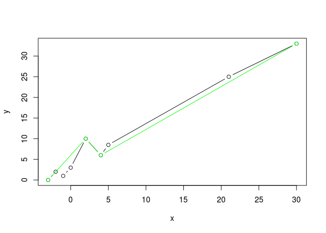
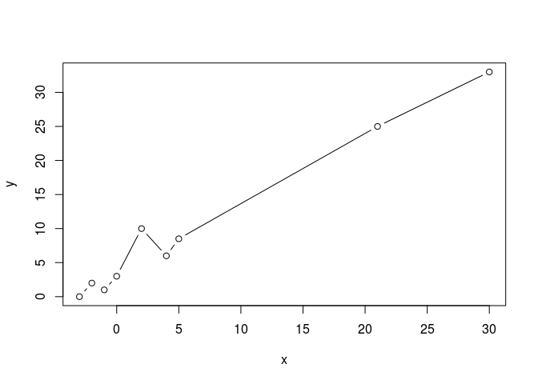
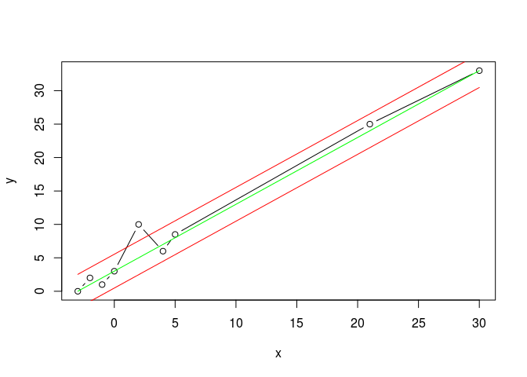
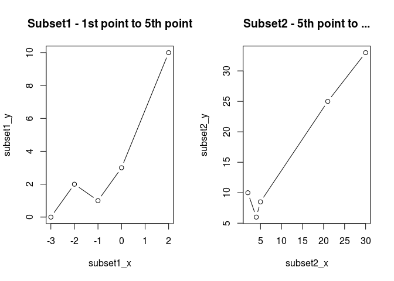
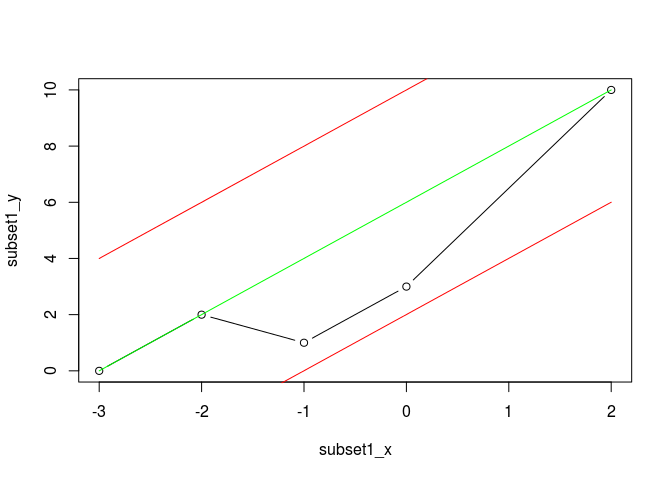
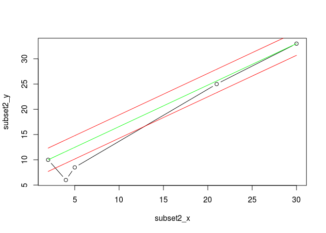
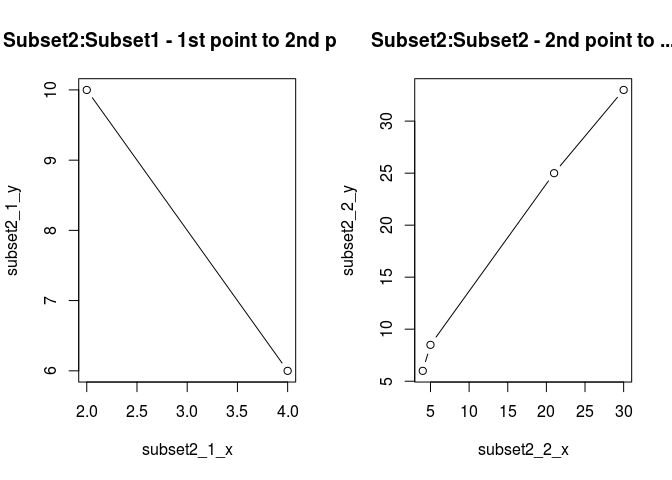
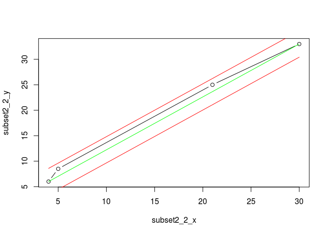

# Test Scenario 2
ppar  
03. nov. 2015  

#Assumption
Some of the vertices in the curve passed to the algorithm are outside of the provided distance (`distance` threshold).

##Outcome
The list of vertices is going to be simplified according to **visualization** information provided below.


```r
x <-c(-3.0,-2.0,-1.0,0.0, 2.0,4.0,5.0,21.0,30.0)
y <- c(0.0, 2.0, 1.0,3.0,10.0,6.0,8.5,25.0,33.0)

#Simplified curve based on details below
x_s <-c(-3.0, 2.0,4.0,30.0)
y_s <- c(0.0,10.0,6.0,33.0)
plot(x, y, type="b", col="black")
lines(x_s, y_s, type= "b", col="green")
```

 


##Details
The provided vertices and their curve.


```r
distance <- 2.0
x <-c(-3.0,-2.0,-1.0,0.0, 2.0,4.0,5.0,21.0,30.0)
y <- c(0.0, 2.0, 1.0,3.0,10.0,6.0,8.5,25.0,33.0)

plot(x, y, type="b", col="black")
```

 

Drawing the line between first and last vertex of the provided curve, and the 2 parallel lines located at `+/- distance`.


```r
line_1 <- x + 3 # y = m x + b

#Let's find the perpendicolar line and make it pass from a Point (xp, yp) in line1
# y = (-1/m) (x - xp) + yp

#Using line1 and its points, lets calculate the angle alpha between the line1 and x-axis
#Points: -3,0 and 30, 33
delta_x <- 30 + 3
delta_y <- 0 + 33
ref_x <- distance * cos(90 - (atan2(delta_y,delta_x)))
ref_y <- distance * sin(90 - (atan2(delta_y,delta_x)))

line_1_plus_threshold <- (x - (-3 - ref_x)) + ref_y
line_1_minu_threshold <- (x - (-3 + ref_x)) - ref_y
```


```r
plot(x, y, type="b")
lines(x, line_1, col="green")
lines(x, line_1_plus_threshold, col="red")
lines(x, line_1_minu_threshold, col="red")
```

 

As we can see the 5th vertex is outside of the threshold area so teh algorithm will split the list of vertices in 2 subset

```r
subset1_x <- x[1:5]
subset1_y <- y[1:5]
subset2_x <- x[5:length(x)]
subset2_y <- y[5:length(y)]
par(mfrow = c(1,2))
plot(subset1_x, subset1_y, type="b", main = "Subset1 - 1st point to 5th point")
plot(subset2_x, subset2_y, type="b", main = "Subset2 - 5th point to ...")
```

 

### Analysis of subset 1

```r
# (3,0) - (2,10)
subset1_line <- (2 * subset1_x + 6)# y = m x + b

#Let's find the perpendicolar line and make it pass from a Point (xp, yp) in line1
# y = (-1/m) (x - xp) + yp

#Using line1 and its points, lets calculate the angle alpha between the line1 and x-axis
#Points: -3,0 and 2, 10
delta_x <- -(-3) + 2
delta_y <- 0 + 10
ref_x <- distance * cos(90 - (atan2(delta_y,delta_x)))
ref_y <- distance * sin(90 - (atan2(delta_y,delta_x)))

subset1_line_plus_threshold <- 2 * (subset1_x - (-3 - ref_x)) + ref_y
subset1_line_minu_threshold <- 2 * (subset1_x - (-3 + ref_x)) - ref_y
```


```r
plot(subset1_x, subset1_y, type="b")
lines(subset1_x, subset1_line, col="green")
lines(subset1_x, subset1_line_plus_threshold, col="red")
lines(subset1_x, subset1_line_minu_threshold, col="red")
```

 

All of the points in the `subset1` are included in the threshold area. So only the 1st and last points are considered for the simplification process.

### Analysis of subset 2

```r
# (2,10) - (30,33)
subset2_line <- ((23/28) * subset2_x + (117/14))# y = m x + b

#Let's find the perpendicolar line and make it pass from a Point (xp, yp) in line1
# y = (-1/m) (x - xp) + yp

#Using line1 and its points, lets calculate the angle alpha between the line1 and x-axis
#Points: 2,10 and 30,33
delta_x <- -(2) + 30
delta_y <- -(10) + 33
ref_x <- distance * cos(90 - (atan2(delta_y,delta_x)))
ref_y <- distance * sin(90 - (atan2(delta_y,delta_x)))

subset2_line_plus_threshold <- (23/28) * (subset2_x - (2 - ref_x)) + (10 + ref_y)
subset2_line_minu_threshold <- (23/28) * (subset2_x - (2 + ref_x)) + (10 - ref_y)
```


```r
plot(subset2_x, subset2_y, type="b")
lines(subset2_x, subset2_line, col="green")
lines(subset2_x, subset2_line_plus_threshold, col="red")
lines(subset2_x, subset2_line_minu_threshold, col="red")
```

 
The 2nd and 3rd points in the `subset2` are outside of the threshold area. Actually the 2nd point has the highest distance from the __green__ line.

The `subset2` is split in two subsets


```r
subset2_1_x <- subset2_x[1:2]
subset2_1_y <- subset2_y[1:2]
subset2_2_x <- subset2_x[2:length(subset2_x)]
subset2_2_y <- subset2_y[2:length(subset2_y)]
par(mfrow = c(1,2))
plot(subset2_1_x, subset2_1_y, type="b", main = "Subset2:Subset1 - 1st point to 2nd point")
plot(subset2_2_x, subset2_2_y, type="b", main = "Subset2:Subset2 - 2nd point to ...")
```

 

####Analysis of Subset2_1
**Subset2_1** contains only two points so **no simplification** can be applied to this curve. Both the points will be returned into the simplified list of vertices.

####Analysis of Subset2_2


```r
# (4,6) - (30,33)
subset2_2_line <- ((27/26) * subset2_2_x + (24/13))# y = m x + b

#Let's find the perpendicolar line and make it pass from a Point (xp, yp) in line1
# y = (-1/m) (x - xp) + yp

#Using line1 and its points, lets calculate the angle alpha between the line1 and x-axis
#Points: 4,6 and 30,33
delta_x <- -(4) + 30
delta_y <- -(6) + 33
ref_x <- distance * cos(90 - (atan2(delta_y,delta_x)))
ref_y <- distance * sin(90 - (atan2(delta_y,delta_x)))

subset2_2_line_plus_threshold <- (27/26) * (subset2_2_x - (4 - ref_x)) + (6 + ref_y)
subset2_2_line_minu_threshold <- (27/26) * (subset2_2_x - (4 + ref_x)) + (6 - ref_y)
```


```r
plot(subset2_2_x, subset2_2_y, type="b")
lines(subset2_2_x, subset2_2_line, col="green")
lines(subset2_2_x, subset2_2_line_plus_threshold, col="red")
lines(subset2_2_x, subset2_2_line_minu_threshold, col="red")
```

 

All of the points in the `subset2_2` are included in the threshold area. So only the 1st and last points are considered for the simplification process.
